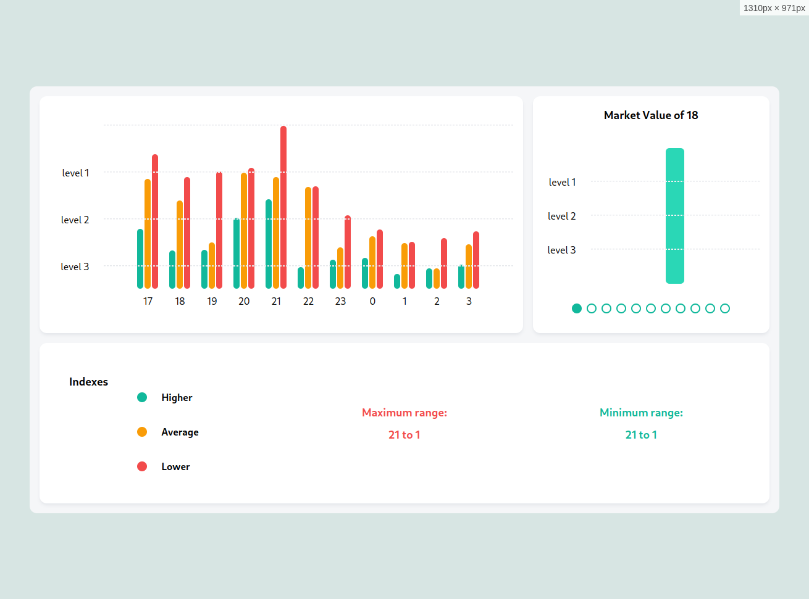

# Chart for Smartpath



## Table of Contents

- **[Note](#note)**
- **[Packages](#packages)**
- **[Project Structure](#project-structure)**
  - [app directory](#app-directory)
  - [lib directory](#lib-directory)
- **[Naming Convention](#naming-convention)**
- **[Installation](#installation)**

## A Quick Note <a id="note"></a>

For this project, I aimed to demonstrate my proficiency in React by utilizing a minimal number of packages. I handcrafted all the components from scratch to showcase my approach and coding style. While the components may not be as extensible as they could be, given the time constraints, I focused on delivering a functional demonstration of my skills.

## Packages <a id="packages"></a>

- `Framer Motion` for animation
- `Tailwind CSS` for easy-to-use classes for styling
- `classnames` for conditional classes

In addition to these packages, the project utilizes basic React setup, formatting, and linting packages.

## Project Structure <a id="project-structure"></a>

This section outlines the structure of the project and reflects my approach to organizing React projects.

### app directory <a id="app-directory></a>

Contains the pages of the application, with each subdirectory representing a sub-route for navigation.

### lib directory <a id="lib-directory></a>

#### lib/components/common

Stores general-purpose components such as dialogs and buttons that are used across various parts of the application.

#### lib/components/features

Houses encapsulated components, providers, and other related elements specific to particular features of the application. This helps maintain modularity and enhances code organization.

#### lib/types

Hosts global types used throughout the project. This directory helps ensure type safety and consistency across different modules and components.

#### lib/utils

Contains utility functions, including validation and helper functions, that are utilized across the project. This central location simplifies access to commonly used functionalities and promotes code reusability.

## Naming Convention <a id="naming-convention"></a>

In this project, I adhere to a consistent naming convention to maintain clarity and organization:

- I prefix all types with either `I` for interfaces or `T` for types.
- Classes and React components begin with a capital letter, distinguishing them from types and interfaces.

This approach aids in quickly differentiating between types, interfaces, classes, and components, contributing to a more organized codebase.

## Installation <a id="installation"></a>

clone the git repo.

### After Cloning

Go to the direcotry where the repo is cloned, Open a terminal and then,

**Installing Dependencies**

```sh
> npm i
```

**Installing Husky** (only for developement)

```sh
> npm run post-install
> chmod +x .husky/pre-commit
```

**Run the application**

```sh
> npm start
```

---

> [!TIP]
> I did use the AI for generating the README file
